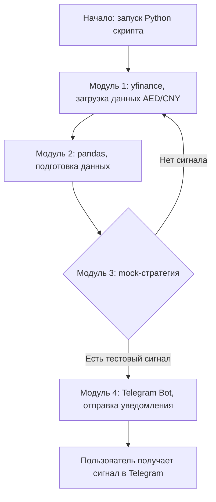

# Trade Signal Bot

Trade Signal Bot - это Python-бот для получения рыночных данных, их базового анализа и отправки торгового сигнала в Telegram.

## Назначение

Бот нужен как основа для системы торговых уведомлений. Он подписывается на источник рыночных данных, обрабатывает данные, проверяет торговую стратегию и отправляет результат пользователю в Telegram.

На текущем этапе бот не открывает сделки и не выполняет торговые действия автоматически. Конечная точка сценария - уведомление в Telegram.

## Цель

Цель проекта - проверить полный MVP-пайплайн генерации сигнала:

1. Получить данные по выбранному активу.
2. Подготовить данные для анализа.
3. Проверить временную тестовую стратегию.
4. Отправить сигнал в Telegram.

В качестве демонстрационного инструмента можно использовать валютную пару `AED/CNY OTC`.

## Настраиваемые параметры

Бот должен поддерживать замену торгового инструмента без изменения основной логики.

Базовые параметры:

- `symbol` - валютная пара или другой торговый инструмент, например `AED/CNY OTC`;
- `interval` - таймфрейм свечей, по умолчанию `15m`;
- `lookbackPeriod` - период истории, который нужен для анализа и расчета mock-стратегии.

По умолчанию MVP можно запускать с `interval=15m`, но позже интервал должен настраиваться под выбранную стратегию: `1m`, `5m`, `15m`, `1h` или другой доступный вариант источника данных.

## Основной сценарий

1. Python-скрипт запускает процесс проверки.
2. Модуль данных получает котировки по выбранному `symbol` и `interval` через `yfinance` или другой доступный источник.
3. Данные передаются в `pandas` для подготовки и базового анализа.
4. Mock-стратегия проверяет простое условие для теста работы бота.
5. Если сигнал не найден, бот возвращается к следующей проверке данных.
6. Если сигнал найден, бот отправляет уведомление в Telegram.

## Архитектура MVP



## Модули

### Модуль данных

Отвечает за получение котировок выбранного актива. На старте можно использовать `yfinance`, если источник поддерживает нужный инструмент и нужный `interval`.

Пример задачи модуля:

- получить последние свечи или цены по выбранному `symbol`;
- использовать `interval=15m` как значение по умолчанию;
- привести данные к формату `pandas.DataFrame`;
- передать данные в модуль анализа.

### Модуль анализа

Отвечает за подготовку данных через `pandas`.

Пример обработки:

- сортировка данных по времени;
- расчет средней цены за выбранный период;
- получение последней цены;
- подготовка входных данных для стратегии.

### Mock-стратегия

На первом этапе используется временная стратегия только для проверки работы бота.

Пример простой логики:

- если последняя цена выше средней цены за выбранный период, бот формирует тестовый сигнал `BUY`;
- если условие не выполнено, бот не отправляет сигнал.

Эта стратегия не является торговой рекомендацией и нужна только для проверки пайплайна. Позже ее можно заменить на реальную стратегию: пересечение скользящих средних, набор технических индикаторов, AI-анализ или другой алгоритм.

### Telegram-уведомления

Telegram Bot отправляет пользователю текстовый сигнал.

Пример формата сообщения:

```text
Актив: AED/CNY OTC
Сигнал: BUY
Цена: 1.9825
Причина: последняя цена выше средней цены за период
Источник: mock-стратегия
```

## Статус проекта

Текущий статус - проектирование MVP.

На данном этапе фиксируется базовый сценарий:

- получение данных;
- анализ через `pandas`;
- временная mock-стратегия;
- отправка уведомления в Telegram.

## Следующие шаги

1. Реализовать получение данных по выбранному активу.
2. Добавить обработку данных через `pandas`.
3. Реализовать mock-стратегию для тестовой генерации сигнала.
4. Подключить Telegram Bot API.
5. Проверить полный цикл работы бота на тестовом активе.
6. Заменить mock-стратегию на реальную торговую стратегию.
